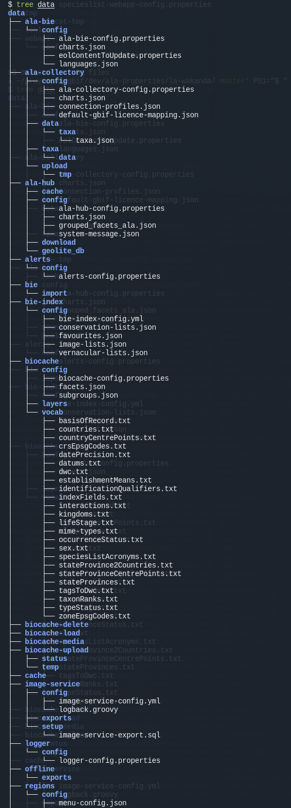

## Introduction

*Work in progress*

Many times we need some LA configurations, those generated by [ala-install](https://github.com/AtlasOfLivingAustralia/ala-install/) typically in `/data` when using `ansible` to deploy a LA portal.

These configurations are useful for instance:
- To setup a [LA Development environment](https://github.com/AtlasOfLivingAustralia/documentation/wiki/LA-Development-Guide#development-configuration).
- On docker LA deployments that don't use `ala-install`.

More than these configurations, it's also important to have a correct directory hierarchy, users/groups and permissions of this `/data` directory and descendants.

So many times people ask in our slack channel for these configurations, or ask for the permissions of some of these directories.

This helper generate this `/data` for you, using `docker` + `ala-install` + some-inventories and some basic steps.

## Prerequisites

### This repo

Clone or download this repository and follow these steps:

### Some inventories

You will need some LA generated `ansible` inventories, use the [command line](https://github.com/living-atlases/generator-living-atlas/) or the web interface: [https://generator.l-a.site](https://generator.l-a.site).

Setup a `LA_INV` enviroment shell variable pointing to the directory of these inventories:

```bash
export LA_INV=/home/myuser/the/directory/where/I/unziped/the/inventories
```

### Some `data` directory 

If you need some development environment, create a `/data` owned by you:

```bash
sudo mkdir /data
sudo chown youruser:youruser /data
export DATA_DIR=/data/
```

or if you don't need it for a develoment environment, you can create a data directory in any other location:

```bash
mkdir /tmp/data
export DATA_DIR=/tmp/data/
```

We'll use this `DATA_DIR` as a volume in the docker image.

### docker

As we mentioned above, we use `docker` to run `ansible` inside a container and generate that LA `/data` for you. 

So you need to [install docker](https://docs.docker.com/engine/install/) in the computer you are using.

### Optionally the `ala-install` repository

You can provide an `ala-install` cloned repository as a docker volume, or if not, we'll use a stable version for you.

Let's setup this in a variable also:

```bash
export ALA_INSTALL=/home/myuser/ala-install-location/
```

## Build

Now you can build this image:

```bash
./do build 
```
## Or directly push

TODO publish to docker hub

## Run

### Run the image with stable `ala-install` 

```bash
./do --data=$DATA_DIR --inv=$LA_INV run
```
 
### Or run the image with some other `ala-install` 

Clone `ala-install` in some directory. Take into account that we patch `ala-install` a bit to run some properties/config tasks without installing sofware. You can patch it with:

```bash
(cd $ALA_INSTALL && patch -p1 < $PWD/ala-install.patch)
```
And run this image with that `ala-install` volume.

```bash
./do --data=$DATA_DIR --inv=$LA_INV --ala-install=$AL_INSTALL run
```

### Finally, generate all `/data` in `DATA_DIR`

```bash
./do generate
```

In the previous step we configured the `ssh` to fake a bit your inventories hostnames, so ansible will access via `ssh` to localhost and configure the `DATA_DIR` volume.

At the end your configs will be accesible in:

```bash
ls -l $DATA_DIR
```

Check the `uid`/`gid` of each user with:

```bash
docker exec -i -t  la-data-generator bash -c 'id tomcat7; id solr; id image-service; id postgres'
```
## Re-run

You can edit your inventories to fit better to your needs, [update the inventories](https://github.com/living-atlases/generator-living-atlas#rerunning-the-generator), and rerun the previous `ansiblew` docker exec command to update your `DATA_DIR`.

## Stop and remove the container 

```bash
docker stop la-data-generator
```
## Sample `DATA_DIR` output



## Further help

```
$ ./do -h
do: LA data generator

Usage:
  do [options] build
  do [options] --data=<dir> --inv=<dir> [--ala-install=<dir>] run
  do [options] generate
  do -h | --help
  do -v | --version

Options:
  --verbose            Verbose output.
  -d --dry-run         Print the commands without actually running them.
  -h --help            Show this help.
  -v --version         Show version.

```

## Caveats

- Currently we don't generate `cas` and `spatial` properties, because their playbooks use `include_role` and we cannot run only the `properties` tag.

## License

Apache-2.0 © [Living Atlases](https://living-atlases.gbif.org)
